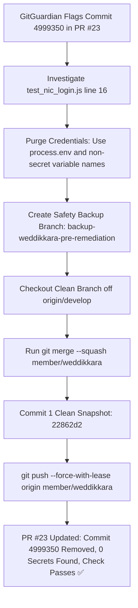

# ASVANNA Platform: Git Workflow & Commands Master Guide
# අස්වැන්න ව්‍යාපෘතිය: Git විධාන සහ ක්‍රියාවලීන් පිළිබඳ පූර්ණ මාර්ගෝපදේශය

This document provides a comprehensive bilingual (English & සිංහල) reference explaining every Git command used throughout our project development lifecycle, why each was executed, and what it accomplished under the hood.

මෙම ලේඛනය අපගේ ව්‍යාපෘතිය ආරම්භයේ සිට මේ දක්වා භාවිත කළ සෑම Git විධානයක්ම (commands), ඒවා භාවිත කළේ ඇයිද (Why) සහ ඒවායින් සිදුවන්නේ කුමක්ද (What they do) යන්න සිංහල සහ ඉංග්‍රීසි යන භාෂා ද්විත්වයෙන්ම සවිස්තරාත්මකව පැහැදිලි කරයි.

---

## 📑 Table of Contents / පටුන
1. [Repository State & Inspection Commands / ගබඩාවේ තත්ත්වය පරීක්ෂා කිරීමේ විධාන](#1-repository-state--inspection-commands)
2. [History & Diff Exploration Commands / ඉතිහාසය සහ වෙනස්කම් පරීක්ෂා කිරීමේ විධාන](#2-history--diff-exploration-commands)
3. [Staging & Committing Changes / වෙනස්කම් සූදානම් කිරීම සහ සුරැකීම](#3-staging--committing-changes)
4. [Branch Management & Safety Backups / ශාඛා කළමනාකරණය සහ උපස්ථ සෑදීම](#4-branch-management--safety-backups)
5. [Squash Rebasing & History Rewriting / ඉතිහාසය නැවත ලිවීම සහ රහස්‍ය දත්ත ඉවත් කිරීම](#5-squash-rebasing--history-rewriting)
6. [Remote Synchronization & Safe Force Pushing / GitHub වෙත යැවීම සහ ආරක්ෂිත Force Push කිරීම](#6-remote-synchronization--safe-force-pushing)
7. [Git Ignore & Clean Repository Auditing / Git Ignore සහ පිරිසිදු ගබඩා පරීක්ෂාව](#7-git-ignore--clean-repository-auditing)
8. [Real-World Case Study: The GitGuardian Secret Remediation / සැබෑ උදාහරණය: GitGuardian රහස්‍ය දෝෂය විසඳීම](#8-real-world-case-study-the-gitguardian-secret-remediation)

---

## 1. Repository State & Inspection Commands

### 1.1 `git status`
* **English:**
  * **What it does:** Displays the current state of the working directory and staging area. Shows which branch is currently checked out, which files are modified, which files are staged for the next commit, and which files are untracked.
  * **Why we used it:** We ran `git status` before and after every operation to ensure no unintended files were modified, to see which files needed staging, and to confirm that `.gitignore` was properly ignoring files like `CHANGE_*.md`.
* **සිංහල:**
  * **සිදුවන දේ:** දැනට ඔබ සිටින branch එක, වෙනස් කරන ලද ගොනු (modified files), commit කිරීමට සූදානම් කර ඇති ගොනු (staged files), සහ Git විසින් track නොකරන ලද නව ගොනු (untracked files) පෙන්වයි.
  * **භාවිත කළ හේතුව:** කිසියම් වෙනසක් කිරීමට පෙර සහ පසු, අනවශ්‍ය ගොනු වෙනස් වී ඇත්දැයි බැලීමටත්, commit කිරීමට සූදානම් ගොනු මොනවාදැයි තහවුරු කර ගැනීමටත්, `.gitignore` ගොනුව මගින් `CHANGE_*.md` ගොනු නිවැරදිව ignore කර ඇත්දැයි බැලීමටත් නිතරම භාවිත කළෙමු.
```bash
git status
```

---

### 1.2 `git branch -a`
* **English:**
  * **What it does:** Lists all branches existing in the local repository as well as all remote-tracking branches fetched from GitHub (prefixed with `remotes/origin/`).
  * **Why we used it:** Used to verify the exact spelling of our active branch (`member/weddikkara`), ensure tracking with `origin/member/weddikkara`, and locate target integration branches such as `develop` and `main`.
* **සිංහල:**
  * **සිදුවන දේ:** ඔබේ පරිගණකයේ ඇති සියලුම local branches මෙන්ම GitHub හි ඇති remote branches (`remotes/origin/` ලෙස) සියල්ල ලැයිස්තුගත කර පෙන්වයි.
  * **භාවිත කළ හේතුව:** අපගේ ක්‍රියාකාරී ශාඛාවේ නම (`member/weddikkara`) නිවැරදිව තහවුරු කර ගැනීමටත්, එය GitHub හි ඇති දුරස්ථ ශාඛාව සමඟ සම්බන්ධ වී ඇත්දැයි බැලීමටත්, `develop` සහ `main` ශාඛා පිහිටීම සොයා ගැනීමටත් භාවිත කළෙමු.
```bash
git branch -a
```

---

### 1.3 `git remote -v`
* **English:**
  * **What it does:** Displays the URLs of all remote repositories that the local repository is configured to communicate with for fetching and pushing.
  * **Why we used it:** To verify that `origin` was pointing to the official repository `https://github.com/NirMAN-15/asvanna.git`.
* **සිංහල:**
  * **සිදුවන දේ:** පරිගණකයේ ඇති Git repository එක සම්බන්ධ වී ඇති GitHub ගබඩාවේ නිවැරදි URL ලිපිනය (fetch සහ push සඳහා) පෙන්වයි.
  * **භාවිත කළ හේතුව:** අපගේ කේත යවනු ලබන්නේ නියම `https://github.com/NirMAN-15/asvanna.git` ගබඩාවටම බවට තහවුරු කර ගැනීමටයි.
```bash
git remote -v
```

---

## 2. History & Diff Exploration Commands

### 2.1 `git diff` & `git diff --stat`
* **English:**
  * **What it does:** Shows the exact line-by-line additions and deletions across files that have not yet been staged. Adding `--stat` provides a high-level summary of changed files and lines inserted/deleted.
  * **Why we used it:** To audit all modifications across the frontend and backend (e.g. 33 files, 5461 additions) before committing, verifying that changes were clean and intended.
* **සිංහල:**
  * **සිදුවන දේ:** තවමත් commit කිරීමට සූදානම් නොකළ (unstaged) ගොනුවල සිදු කර ඇති සියලුම පේළි මට්ටමේ වෙනස්කම් (line-by-line diff) පෙන්වයි. `--stat` යෙදූ විට කුමන ගොනු කීයක පේළි කීයක් වෙනස් වී ඇත්දැයි කෙටි සාරාංශයක් ලබා දේ.
  * **භාවිත කළ හේතුව:** Frontend සහ Backend ගොනු 33 ක සිදු කළ පේළි 5,460 කට වැඩි වෙනස්කම් නිවැරදිදැයි පරීක්ෂා කර තහවුරු කර ගැනීමට භාවිත කළෙමු.
```bash
git diff
git diff --stat
```

---

### 2.2 `git diff --cached` / `git diff --staged`
* **English:**
  * **What it does:** Compares staged changes (in the Git index) against the last commit (`HEAD`). Shows what is about to be saved in the next commit.
  * **Why we used it:** Crucial verification step: `git diff --cached --name-only | grep -i change` confirmed that NO change log markdown files (`CHANGE_*.md`) were accidentally staged into git.
* **සිංහල:**
  * **සිදුවන දේ:** Commit කිරීම සඳහා දැනට stage කර ඇති වෙනස්කම්, අවසන් commit එක සමඟ සංසන්දනය කර පෙන්වයි.
  * **භාවිත කළ හේතුව:** අප commit කිරීමට යන දේ අතර කිසිදු `CHANGE_*.md` ගොනුවක් වැරදීමකින් හෝ ඇතුළත් වී නැති බව 100% ක්ම තහවුරු කර ගැනීමට මෙය භාවිත කළෙමු.
```bash
git diff --cached --name-only
```

---

### 2.3 `git log --oneline --graph`
* **English:**
  * **What it does:** Draws an ASCII-art graphical representation of commit history, showing branching points, merges, and commit hashes in a single-line summary.
  * **Why we used it:** Essential for diagnosing how our branch diverged from `develop`, visualizing merge commit `4999350`, and understanding why GitGuardian found 7 commits in PR #23.
* **සිංහල:**
  * **සිදුවන දේ:** Commit ඉතිහාසය, විවිධ ශාඛා බෙදී ගිය ආකාරය සහ merge වූ ආකාරය තනි පේළියේ සාරාංශයක් ලෙස රූප සටහනක් (graph) මගින් පෙන්වයි.
  * **භාවිත කළ හේතුව:** අපගේ ශාඛාව `develop` ශාඛාවෙන් වෙනස් වූයේ කෙසේද යන්නත්, `4999350` නම් ගැටළු සහගත merge commit එක පැමිණියේ කොහෙන්ද යන්නත්, PR #23 තුළ commits 7ක් පෙන්නුම් කළේ ඇයිද යන්නත් පැහැදිලිව හඳුනා ගැනීමට මෙය අත්‍යවශ්‍ය විය.
```bash
git log --oneline --graph -n 15
```

---

### 2.4 `git log origin/develop..member/weddikkara`
* **English:**
  * **What it does:** Lists only the commits that exist on `member/weddikkara` but do NOT exist on `origin/develop`. This is exactly what GitHub displays in Pull Request #23.
  * **Why we used it:** Allowed us to see the exact 7 commits that GitGuardian was scanning, proving that `4999350` was part of the PR's unique commit range.
* **සිංහල:**
  * **සිදුවන දේ:** `develop` ශාඛාවේ නොමැති, නමුත් `member/weddikkara` ශාඛාවේ පමණක් ඇති commit මොනවාදැයි පෙන්වයි. GitHub Pull Request එකක් මගින් ස්කෑන් කරනු ලබන්නේ ακම මෙම commit ලැයිස්තුවයි.
  * **භාවිත කළ හේතුව:** GitGuardian මගින් ස්කෑන් කරනු ලැබූ commits 7 නිශ්චිතව හඳුනා ගැනීමට සහ එම commit ලැයිස්තුව තුළ `4999350` commit එක ඇති බව ඔප්පු කර ගැනීමට මෙය යොදා ගත්තෙමු.
```bash
git log origin/develop..member/weddikkara --oneline
```

---

## 3. Staging & Committing Changes

### 3.1 `git add .` / `git add <file>`
* **English:**
  * **What it does:** Adds file modifications in the working directory to the staging area (index), preparing them to be committed.
  * **Why we used it:** To stage our updated `.gitignore`, backend endpoints, trilingual translation dictionaries, and UI page enhancements.
* **සිංහල:**
  * **සිදුවන දේ:** වෙනස් කරන ලද ගොනු හෝ අලුතින් එක් කළ ගොනු staging area එකට (commit කිරීමට පෙර සූදානම් කරන ස්ථානයට) එක් කරයි.
  * **භාවිත කළ හේතුව:** යාවත්කාලීන කළ `.gitignore` ගොනුව, backend කේත, භාෂා ත්‍රිත්වයේම පරිවර්තන ගොනු සහ frontend UI පිටු commit කිරීමට සූදානම් කර ගැනීමටයි.
```bash
git add .
git add backend/test/test_nic_login.js
```

---

### 3.2 `git commit -m "<message>"`
* **English:**
  * **What it does:** Takes all staged changes and permanently records a new snapshot in Git history with an informative commit log message.
  * **Why we used it:** Saved milestones with clear descriptions adhering to the conventional commits standard (`feat: ...`, `fix: ...`).
* **සිංහල:**
  * **සිදුවන දේ:** Staging area හි ඇති සියලුම වෙනස්කම් විස්තරාත්මක පණිවිඩයක් සමඟ Git ඉතිහාසයේ ස්ථිර snapshot එකක් ලෙස සුරකියි.
  * **භාවිත කළ හේතුව:** සිදු කළ සියලු වැඩිදියුණු කිරීම් සහ අලුත්වැඩියාවන් අනාගතයේදී පහසුවෙන් හඳුනාගත හැකි පරිදි පැහැදිලි සටහනක් සහිතව තැන්පත් කිරීමටයි.
```bash
git commit -m "feat: complete trilingual localization, history dual-tab hub, harvest deallocation, and officer governance"
```

---

## 4. Branch Management & Safety Backups

### 4.1 `git branch <backup-name>`
* **English:**
  * **What it does:** Creates a new branch reference pointing to the current commit without switching the working branch away.
  * **Why we used it:** Before performing history rewrites to fix GitGuardian, we created `backup-weddikkara-pre-remediation`. This guaranteed that our full work was 100% safe and recoverable under any scenario.
* **සිංහල:**
  * **සිදුවන දේ:** ඔබ දැනට සිටින ස්ථානයේම නව branch එකක් සාදයි (නමුත් ඔබව එම branch එකට මාරු නොකරයි).
  * **භාවිත කළ හේතුව:** Git ඉතිහාසය නැවත ලිවීමට පෙර කිසිදු කේතයක් අහිමි නොවන බවට 100% ක් සහතික වීම සඳහා `backup-weddikkara-pre-remediation` නමින් ආරක්ෂිත උපස්ථයක් සාදා ගත්තෙමු.
```bash
git branch backup-weddikkara-pre-remediation
```

---

### 4.2 `git checkout -b <branch-name> <base>`
* **English:**
  * **What it does:** Creates a new branch starting from `<base>` (e.g. `origin/develop`) and immediately switches the working tree to it.
  * **Why we used it:** We created `member/weddikkara-clean` directly off `origin/develop` to assemble a completely fresh branch free of stale merge commits and security triggers.
* **සිංහල:**
  * **සිදුවන දේ:** දක්වා ඇති මූලික ශාඛාවෙන් (`origin/develop`) නව ශාඛාවක් සාදා කෙලින්ම එම නව ශාඛාවට මාරු වේ.
  * **භාවිත කළ හේතුව:** පැරණි අවුල් සහගත merge commits සහ GitGuardian හසු වූ commit නොමැති, සම්පූර්ණයෙන්ම පිරිසිදු නව ශාඛාවක් (`member/weddikkara-clean`) නිර්මාණය කිරීමට මෙය භාවිත කළෙමු.
```bash
git checkout -b member/weddikkara-clean origin/develop
```

---

### 4.3 `git branch -D <branch-name>`
* **English:**
  * **What it does:** Forcefully deletes a local branch regardless of its merge status.
  * **Why we used it:** Once the clean commit was applied back to `member/weddikkara`, the temporary branch `member/weddikkara-clean` was safely removed to keep our local repository uncluttered.
* **සිංහල:**
  * **සිදුවන දේ:** පරිගණකයේ ඇති ඕනෑම branch එකක් බලහත්කාරයෙන් මකා දමයි (delete).
  * **භාවිත කළ හේතුව:** තාවකාලිකව සාදාගත් `member/weddikkara-clean` ශාඛාවේ කාර්යය අවසන් වූ පසු ගබඩාව පිරිසිදුව තබා ගැනීමට එය මකා දැමීමටයි.
```bash
git branch -D member/weddikkara-clean
```

---

## 5. Squash Rebasing & History Rewriting

### 5.1 `git merge --squash <source-branch>`
* **English:**
  * **What it does:** Takes all commits from `<source-branch>` and applies their net cumulative difference directly into the current working directory and staging area as an uncommitted change. It does NOT import individual commit objects, commit messages, or parent references.
  * **Why we used it:** **This was the core technical solution.** By squash-merging our work onto `origin/develop`, all 5,400+ lines of work, translations, and features were preserved, but the offending commit `4999350b3ecdbffbce24a27cb44b1b8bdeb7fcb3` was completely left behind!
* **සිංහල:**
  * **සිදුවන දේ:** වෙනත් ශාඛාවක ඇති සියලුම commit එකට එකතු කර (squash), ඒවායේ සමස්ත වෙනස්කම පමණක් තනි වෙනසක් ලෙස දැනට සිටින ශාඛාවේ staging area එකට ගෙන එයි. පැරණි commit ඉතිහාසය හෝ ඒවායේ තිබූ දෝෂ මෙයට ගෙන එන්නේ නැත.
  * **භාවිත කළ හේතුව:** **GitGuardian ගැටළුව විසඳූ ප්‍රධාන විධානය මෙයයි.** අප සිදු කළ පේළි 5,400 කට අධික සියලුම වටිනා කේත සුරකිමින්, GitGuardian මගින් අසු වූ පැරණි `4999350` commit එක සම්පූර්ණයෙන්ම ඉතිහාසයෙන් මකා දමා තනි පිරිසිදු commit එකක් බවට පත් කිරීමට මෙය උපකාරී විය!
```bash
git merge --squash member/weddikkara
```

---

### 5.2 `git reset --hard <target>`
* **English:**
  * **What it does:** Moves the current branch pointer to `<target>` and resets the staging area and working directory to match `<target>` exactly. Any uncommitted changes are discarded.
  * **Why we used it:** After testing our clean commit on `member/weddikkara-clean`, we switched to `member/weddikkara` and ran `git reset --hard` to align our official working branch with the clean commit.
* **සිංහල:**
  * **සිදුවන දේ:** දැනට සිටින branch එකේ හිස (HEAD), staging area එක සහ පරිගණකයේ ඇති ගොනු සියල්ල දක්වා ඇති ඉලක්කගත commit එකට හෝ branch එකට සමාන වන සේ මුළුමනින්ම reset කරයි.
  * **භාවිත කළ හේතුව:** පිරිසිදු කරන ලද නව commit එක අපගේ ප්‍රධාන `member/weddikkara` ශාඛාවට ස්ථිරවම ආරෝපණය කිරීම සඳහායි.
```bash
git reset --hard member/weddikkara-clean
```

---

## 6. Remote Synchronization & Safe Force Pushing

### 6.1 `git fetch origin <branch>`
* **English:**
  * **What it does:** Downloads refs and objects from the remote repository without merging or modifying your working directory.
  * **Why we used it:** To pull down the latest commits from GitHub to see why `git push` was initially rejected due to upstream changes.
* **සිංහල:**
  * **සිදුවන දේ:** පරිගණකයේ වැඩ කරන ගොනුවලට හානියක් නොකර, GitHub හි ඇති අලුත්ම තොරතුරු සහ commits පරිගණකයේ Git දත්ත ගබඩාවට බාගත කර ගනියි.
  * **භාවිත කළ හේතුව:** අප push කිරීමට උත්සාහ කළ විට එය ප්‍රතික්ෂේප වූයේ මන්දැයි බැලීමටත්, GitHub හි ඇති අලුත්ම දත්ත පරීක්ෂා කිරීමටත් භාවිත කළෙමු.
```bash
git fetch origin member/weddikkara
```

---

### 6.2 `git push origin <branch>`
* **English:**
  * **What it does:** Pushes local commits to the corresponding remote branch on GitHub.
  * **Why we used it:** Standard command used to publish commits to GitHub so that team members and Pull Requests can access the changes.
* **සිංහල:**
  * **සිදුවන දේ:** ඔබගේ පරිගණකයේ සාදන ලද commits GitHub හි ඇති දුරස්ථ ශාඛාවට (remote branch) උඩුගත (upload) කරයි.
  * **භාවිත කළ හේතුව:** අප කළ වෙනස්කම් GitHub හි Pull Request එකට එක් කිරීමට සාමාන්‍ය පරිදි යැවීමටයි.
```bash
git push origin member/weddikkara
```

---

### 6.3 `git push --force-with-lease origin <branch>`
* **English:**
  * **What it does:** Updates the remote branch with rewritten local history, but **safely checks** that the remote branch has not received unexpected commits from other developers before overwriting. It is far safer than raw `--force`.
  * **Why we used it:** Because we re-wrote the branch history to eliminate the secret commit flagged by GitGuardian, Git rejected a standard push (since histories diverged). Running `--force-with-lease` updated PR #23 on GitHub with our clean commit, successfully clearing the GitGuardian alert!
* **සිංහල:**
  * **සිදුවන දේ:** Git ඉතිහාසය නැවත ලියූ විට (rebase/squash කළ විට) සාමාන්‍ය push විධානය ප්‍රතික්ෂේප වේ. `--force-with-lease` මගින් ආරක්ෂිතව දුරස්ථ ශාඛාව උඩින් ලියයි (overwrite කරයි). වෙනත් අයෙකු අලුතින් යමක් push කර ඇත්නම් එයට හානි නොවන බවට පරීක්ෂා කර බැලීම මෙහි ඇති විශේෂ ආරක්ෂාවයි (`--force` වලට වඩා බොහෝ ආරක්ෂිතයි).
  * **භාවිත කළ හේතුව:** GitGuardian මගින් සොයාගත් රහස්‍ය දෝෂය සහිත commit එක ඉතිහාසයෙන් ඉවත් කළ පසු, එම පිරිසිදු කළ අලුත්ම commit එක GitHub හි PR #23 වෙත යැවීමට මෙය අනිවාර්ය විය.
```bash
git push --force-with-lease origin member/weddikkara
```

---

## 7. Git Ignore & Clean Repository Auditing

### 7.1 `git status --ignored`
* **English:**
  * **What it does:** Displays all files in the directory tree that are currently matching patterns in `.gitignore`.
  * **Why we used it:** Verified that all `CHANGE_1.md` through `CHANGE_6.md`, `docs/CHANGE_*.md`, and `backend/data/` were completely ignored and would never be committed or pushed.
* **සිංහල:**
  * **සිදුවන දේ:** `.gitignore` ගොනුවේ නීති වලට අනුව Git මගින් නොසලකා හරින ලද (ignore කරන ලද) සියලුම ගොනු පෙන්වයි.
  * **භාවිත කළ හේතුව:** `CHANGE_1.md` සිට `CHANGE_6.md` දක්වා සියලුම ගොනු සහ `backend/data/` ෆෝල්ඩරය නිවැරදිව ignore වී ඇති බව තහවුරු කර ගැනීමටයි.
```bash
git status --ignored
```

---

### 7.2 `git ls-files`
* **English:**
  * **What it does:** Lists information about files in the Git index (tracked files) and the working tree.
  * **Why we used it:** Ran `git ls-files | grep -i change` to prove that no change log files had ever been tracked in version control.
* **සිංහල:**
  * **සිදුවන දේ:** Git විසින් දැනට නිල වශයෙන් track කරනු ලබන සියලුම ගොනු ලැයිස්තුව පෙන්වයි.
  * **භාවිත කළ හේතුව:** Change markdown ගොනු කිසිවක් මීට පෙර Git හි track වී නොමැති බව තහවුරු කර ගැනීමටයි.
```bash
git ls-files | grep -i change
```

---

## 8. Real-World Case Study: The GitGuardian Secret Remediation
### සැබෑ උදාහරණය: GitGuardian රහස්‍ය දෝෂය විසඳීම

Here is the step-by-step summary of how the GitGuardian security incident was resolved:
GitGuardian ආරක්ෂක ගැටළුව විසඳූ ආකාරය පියවරෙන් පියවර මෙසේය:



| Step | Action Taken (English) | ගත් පියවර (සිංහල) | Git Command Used |
| :---: | :--- | :--- | :--- |
| **1** | **Diagnosis:** Identified that commit `4999350` contained a hardcoded fallback string in `backend/test/test_nic_login.js`. | **හඳුනාගැනීම:** `backend/test/test_nic_login.js` ගොනුවේ line 16 හි තිබූ පෙරනිමි මුරපද කැබැල්ල GitGuardian විසින් හසුකර ගන්නා ලදී. | `git show 4999350:backend/test/test_nic_login.js` |
| **2** | **Code Fix:** Replaced hardcoded password fallbacks with `process.env.TEST_USER_PASSWORD` and renamed variables away from `_SECRET`. | **කේතය නිවැරදි කිරීම:** මුරපදය කේතයෙන් ඉවත් කර `.env` මගින් ලබා ගැනීමට සැකසීම සහ variable නම් ආරක්ෂිත කිරීම. | Manual edit via code tools |
| **3** | **Safety Backup:** Created a backup branch to ensure zero data loss. | **ආරක්ෂිත උපස්ථයක් සෑදීම:** කේත අහිමි නොවීම සඳහා backup branch එකක් සෑදීම. | `git branch backup-weddikkara-pre-remediation` |
| **4** | **Rebase Baseline:** Branched directly off the latest `origin/develop`. | **පිරිසිදු මූලයක් ගැනීම:** අලුත්ම `origin/develop` වෙතින් පිරිසිදු ශාඛාවක් ආරම්භ කිරීම. | `git checkout -b member/weddikkara-clean origin/develop` |
| **5** | **Squash Changes:** Flattened all 36 modified files into a single clean staged delta, leaving behind the bad commit `4999350`. | **සියලු වැඩ එක් කිරීම (Squash):** දෝෂ සහිත `4999350` commit එක අතහැර, සියලුම නව කේත තනි commit එකක් ලෙස සකස් කිරීම. | `git merge --squash member/weddikkara` |
| **6** | **Clean Commit:** Committed with a clean description and verified 0 passwords existed in the diff. | **පිරිසිදු Commit එකක් තැබීම:** රහස්‍ය දත්ත බිංදුවක් බව තහවුරු කරමින් නව commit එකක් තැබීම (`22862d2`). | `git commit -m "feat: ..."` |
| **7** | **Apply to Branch:** Reset `member/weddikkara` to the clean commit. | **ශාඛාවට යෙදීම:** ප්‍රධාන ශාඛාව පිරිසිදු commit එකට පෙළගැස්වීම. | `git reset --hard member/weddikkara-clean` |
| **8** | **Publish to GitHub:** Force-pushed with lease to update PR #23. GitGuardian rescans and approves. | **GitHub වෙත යැවීම:** PR #23 යාවත්කාලීන කිරීම සඳහා ආරක්ෂිතව force push කිරීම. GitGuardian පරික්ෂාව සමත් වීම. | `git push --force-with-lease origin member/weddikkara` |

---

*Compiled for the ASVANNA Agricultural Intelligence Engineering Team.*  
*අස්වැන්න කෘෂිකාර්මික බුද්ධි තොරතුරු පද්ධති ඉංජිනේරු කණ්ඩායම වෙනුවෙන් සකස් කරන ලදී.*
