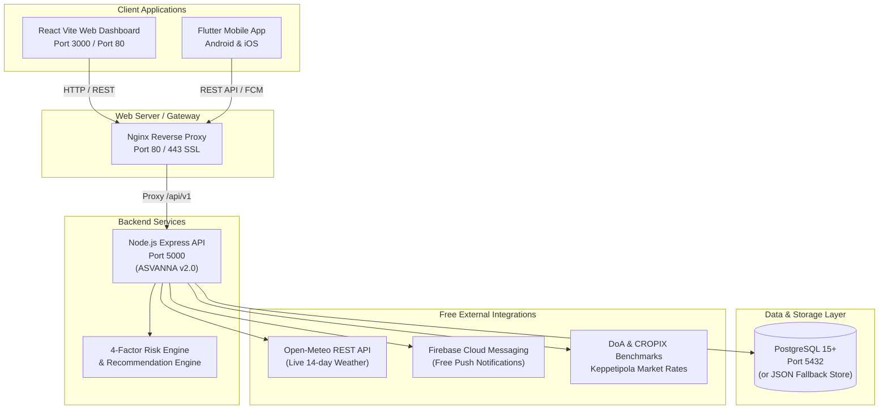

# ASVANNA Agricultural Intelligence Platform — Deployment & Operations Guide
## Pilot Deployment: Bandarawela Agrarian Division, Badulla District, Sri Lanka

---

## 1. System Architecture & Connection Topology



---

## 2. Environment Files Created

| File Path | Purpose | Key Variables |
| :--- | :--- | :--- |
| [`backend/.env`](file:///d:/final-project/backend/.env) | Local backend runtime | `PORT=5000`, `DB_HOST=localhost`, `JWT_SECRET`, `RISK_SAFE_THRESHOLD=40.0` |
| [`backend/.env.production`](file:///d:/final-project/backend/.env.production) | Production backend template | `NODE_ENV=production`, `DB_SSL=true`, Cloud DB host, Firebase keys |
| [`frontend/.env`](file:///d:/final-project/frontend/.env) | Local frontend runtime | `VITE_API_BASE_URL=http://localhost:5000/api/v1` |
| [`frontend/.env.production`](file:///d:/final-project/frontend/.env.production) | Production frontend template | `VITE_API_BASE_URL=https://api.yourdomain.com/api/v1` |
| [`.env`](file:///d:/final-project/.env) | Docker Compose root | `DB_USER`, `DB_PASSWORD`, `DB_NAME`, `DB_PORT`, `PORT=5000` |
| [`backend/ecosystem.config.js`](file:///d:/final-project/backend/ecosystem.config.js) | PM2 Process Manager | Cluster mode, memory ceiling, auto-restart |

---

## 3. How to Connect

### 3.1 Local Development (Dual Terminal)

#### Step 1: Start Backend
```bash
cd backend
npm install
npm run dev
# Running on http://localhost:5000
# Health check: http://localhost:5000/health
```

> **Note on Database**: If PostgreSQL is not installed locally, the backend automatically operates in **Local JSON Persistent Store Mode** (`backend/data/asvanna_db.json`), requiring **zero installation** to run tests, log plantings, and execute marketplace orders.

#### Step 2: Start Frontend Web Dashboard
```bash
cd frontend
npm install
npm run dev
# Access via web browser: http://localhost:3000
```

---

### 3.2 Connecting the Flutter Mobile App

In [`mobile/lib/core/services/api_service.dart`](file:///d:/final-project/mobile/lib/core/services/api_service.dart):

1. **Android Emulator**:
   ```dart
   static String baseUrl = 'http://10.0.2.2:5000/api/v1';
   ```
2. **iOS Simulator**:
   ```dart
   static String baseUrl = 'http://localhost:5000/api/v1';
   ```
3. **Physical Android / iOS Phone (Same Wi-Fi Network)**:
   Find your development machine's local IP address (e.g. `ipconfig` -> `192.168.1.15`):
   ```dart
   static String baseUrl = 'http://192.168.1.15:5000/api/v1';
   ```
4. **Production Deployed Server**:
   ```dart
   static String baseUrl = 'https://api.yourdomain.com/api/v1';
   ```

---

### 3.3 Connecting PostgreSQL Database

If connecting to a standalone PostgreSQL database (Local, AWS RDS, Neon, or Supabase):

```bash
# Verify connection using psql
psql -h localhost -p 5432 -U postgres -d asvanna_db

# Run automated migration script (creates tables & indexes)
node backend/src/database/migrate.js

# Run automated seed script (populates 25 Bandarawela crops & demo users)
node backend/src/database/seed.js
```

---

### 3.4 Connecting Firebase Cloud Messaging (FCM)

For live push notifications to Android/iOS devices:
1. Open [Firebase Console](https://console.firebase.google.com/) and create/select project `asvanna-agritech`.
2. Go to **Project Settings** -> **Service Accounts**.
3. Click **Generate new private key** and download the JSON file.
4. Copy `project_id`, `client_email`, and `private_key` into `backend/.env`.

---

## 4. Deployment Strategies

### Option A: 1-Click Docker Compose Deployment (Recommended for VPS)

Deploys PostgreSQL, Node.js API, and Nginx React frontend in isolated containers.

```bash
# 1. Clone repository to server
git clone <repository_url> /opt/asvanna
cd /opt/asvanna

# 2. Review or update environment values in root .env
nano .env

# 3. Build and run containers in background
docker compose up -d --build

# 4. Verify running containers
docker compose ps

# 5. Check container logs
docker compose logs -f backend
```

- **Frontend**: Available at `http://<SERVER_IP>:3000`
- **Backend API**: Available at `http://<SERVER_IP>:5000/api/v1`

---

### Option B: Traditional Linux VPS (Ubuntu / Debian with PM2 & Nginx)

#### Step 1: Install Prerequisites
```bash
sudo apt update && sudo apt upgrade -y
sudo apt install -y nodejs npm postgresql postgresql-contrib nginx certbot python3-certbot-nginx
sudo npm install -g pm2
```

#### Step 2: Set Up PostgreSQL
```bash
sudo -u postgres psql
# In PostgreSQL prompt:
CREATE DATABASE asvanna_db;
CREATE USER asvanna_user WITH ENCRYPTED PASSWORD 'StrongPassword123!';
GRANT ALL PRIVILEGES ON DATABASE asvanna_db TO asvanna_user;
\q
```

#### Step 3: Configure and Build
```bash
cd /var/www/asvanna/backend
cp .env.production .env
# Edit .env with your DB credentials
npm install --production
node src/database/migrate.js
node src/database/seed.js

# Start backend with PM2
pm2 start ecosystem.config.js --env production
pm2 save
pm2 startup

# Build Frontend
cd /var/www/asvanna/frontend
cp .env.production .env
npm install
npm run build
```

#### Step 4: Configure Nginx Reverse Proxy (`/etc/nginx/sites-available/asvanna`)
```nginx
server {
    listen 80;
    server_name asvanna.gov.lk api.asvanna.gov.lk;

    # Frontend Static Build
    location / {
        root /var/www/asvanna/frontend/dist;
        index index.html;
        try_files $uri $uri/ /index.html;
    }

    # Backend API Proxy
    location /api/ {
        proxy_pass http://127.0.0.1:5000/api/;
        proxy_http_version 1.1;
        proxy_set_header Upgrade $http_upgrade;
        proxy_set_header Connection 'upgrade';
        proxy_set_header Host $host;
        proxy_cache_bypass $http_upgrade;
        proxy_set_header X-Real-IP $remote_addr;
        proxy_set_header X-Forwarded-For $proxy_add_x_forwarded_for;
        proxy_set_header X-Forwarded-Proto $scheme;
    }
}
```

#### Step 5: Enable SSL with Let's Encrypt
```bash
sudo ln -s /etc/nginx/sites-available/asvanna /etc/nginx/sites-enabled/
sudo nginx -t
sudo systemctl restart nginx
sudo certbot --nginx -d asvanna.gov.lk -d api.asvanna.gov.lk
```

---

### Option C: Cloud PaaS Deployment (Render / Railway + Vercel)

1. **Database**: Create a free PostgreSQL instance on [Neon.tech](https://neon.tech) or [Supabase](https://supabase.com).
2. **Backend**:
   - Link `backend/` directory to **Render** or **Railway**.
   - Build command: `npm install`
   - Start command: `node src/database/migrate.js && node src/database/seed.js && node src/server.js`
   - Add environment variables from `backend/.env.production`.
3. **Frontend**:
   - Link `frontend/` directory to **Vercel** or **Netlify**.
   - Build command: `npm run build`
   - Output directory: `dist`
   - Set environment variable: `VITE_API_BASE_URL=https://<your-backend-url>/api/v1`

---

## 5. Health Check & Operational Verification

```bash
# 1. API Health Probe
curl -s http://localhost:5000/health | jq .

# 2. Crop Risk Evaluation Test (Crop #1 = Leeks)
curl -s "http://localhost:5000/api/v1/risk/evaluate?crop_id=1&district=Badulla" | jq .

# 3. 14-Day Open-Meteo Agro Weather Test
curl -s http://localhost:5000/api/v1/weather/forecast | jq .

# 4. Keppetipola Wholesale Rates Benchmark Test
curl -s http://localhost:5000/api/v1/prices/daily | jq .
```
